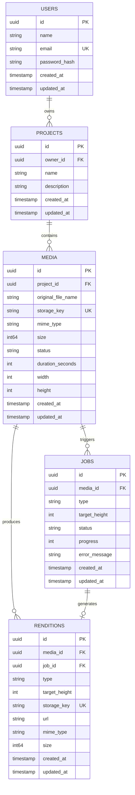
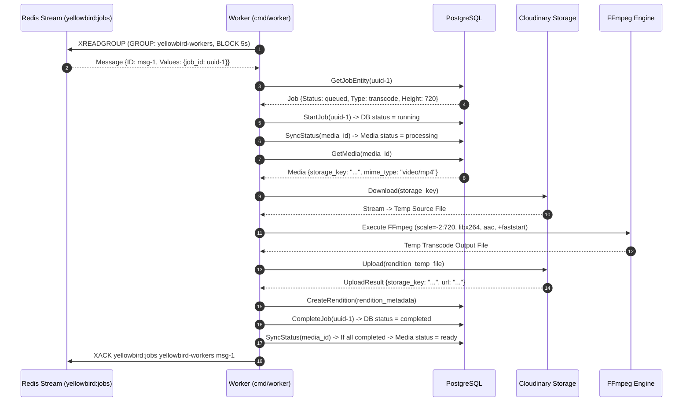

# YellowBird Architecture Deep-Dive

This document provides an in-depth systems-engineering and architectural reference for the YellowBird media processing backend.

---

## 1. System Topology

YellowBird is architected as two decoupled, independently scalable Go binaries that coordinate exclusively through PostgreSQL and Redis Streams:

```mermaid
graph TD
    subgraph Ingress & Client
        Client["Client / WebApp / CLI"]
    end

    subgraph API Node ["API Tier (cmd/api)"]
        Gin["Gin HTTP Engine"]
        MW["Middleware (Auth, RequestID, Recovery, Logging)"]
        Controllers["Domain Handlers"]
        DomainSvc["Domain Services (user, project, media, job, rendition)"]
    end

    subgraph Infrastructure
        Postgres[("PostgreSQL 16+\n• Users / Projects\n• Media Metadata\n• Job State Machine\n• Renditions Metadata")]
        RedisStreams[("Redis 7+ Streams\n• yellowbird:jobs (work queue)\n• yellowbird:jobs:dlq (dead letters)")]
        Cloudinary[("Cloudinary Object Storage\n• Source Uploads\n• Output Renditions")]
    end

    subgraph Worker Pool ["Worker Tier (cmd/worker)"]
        WorkerRuntime["Worker Runtime Loop"]
        PELRecovery["Pending Entries Recovery Loop (30s)"]
        Registry["Processor Registry"]
        Proc_Thumb["Thumbnail Processor"]
        Proc_Prev["Preview Processor"]
        Proc_Trans["Transcode Processor"]
        FFmpegLocal[["FFmpeg Engine / Temp Files"]]
    end

    Client -->|HTTP / Multipart| Gin
    Gin --> MW --> Controllers --> DomainSvc
    DomainSvc -->|ACID State & Row Locks| Postgres
    DomainSvc -->|XADD job_id| RedisStreams
    DomainSvc -->|Upload Raw Media| Cloudinary

    WorkerRuntime -->|XREADGROUP| RedisStreams
    PELRecovery -->|XCLAIM abandoned jobs| RedisStreams
    WorkerRuntime --> Registry
    Registry --> Proc_Thumb & Proc_Prev & Proc_Trans

    Proc_Thumb & Proc_Prev & Proc_Trans -->|Download Source| Cloudinary
    Proc_Thumb & Proc_Prev & Proc_Trans -->|Exec CommandContext| FFmpegLocal
    Proc_Thumb & Proc_Prev & Proc_Trans -->|Upload Artifact| Cloudinary
    Proc_Thumb & Proc_Prev & Proc_Trans -->|Insert Rendition| Postgres

    WorkerRuntime -->|Job status -> completed/failed\nSyncStatus()| Postgres
    WorkerRuntime -->|XACK / Move to DLQ| RedisStreams
```

---

## 2. Core Architectural Invariants

1. **PostgreSQL is the Sole Source of Truth**:
   - All durable state (user identity, project ownership, media lifecycle state, job progress, and rendition URLs) resides in PostgreSQL.
   - Redis Streams are treated as an ephemeral work-delivery fabric. If Redis is flushed, PostgreSQL still retains the exact state of all jobs and media.

2. **Race-Free State Synchronization via Row Locking**:
   - When sibling transcoding/thumbnail jobs complete concurrently across different worker instances, they invoke `mediaRepository.SyncStatus(ctx, mediaID)`.
   - `SyncStatus` executes inside a database transaction with a `SELECT FOR UPDATE` (`clause.Locking{Strength: "UPDATE"}`) on the `media` record. This guarantees that status evaluation (`uploaded` $\rightarrow$ `processing` $\rightarrow$ `ready` or `failed`) is strictly serialized without lost updates.

3. **At-Least-Once Delivery & Idempotent Processing**:
   - Jobs are only removed from the Redis stream (`XACK`) after:
     1. FFmpeg processing finishes successfully.
     2. Output rendition upload to Cloudinary completes.
     3. Rendition row is committed to PostgreSQL.
     4. Job status in PostgreSQL is updated to `completed`.
   - If a worker crashes mid-execution, the unacknowledged job remains in the Redis Pending Entries List (PEL) and is reclaimed by surviving workers.

4. **Quarantine via Dead-Letter Queue (DLQ)**:
   - A job is allowed up to 3 delivery attempts (`deliveryCount >= 3`).
   - On the 3rd failed attempt, the job is moved to `yellowbird:jobs:dlq`, the database job is marked `failed`, parent media status transitions to `failed`, and the original message is acknowledged.

---

## 3. Data Model & Entity Relations



---

## 4. Worker Processing & Failure Recovery Cycle



---

## 5. Reliability Specifications

| Mechanism | Configuration | Implementation Location |
| :--- | :--- | :--- |
| **Stream Key** | `yellowbird:jobs` | `internal/queue/redis.go` |
| **Consumer Group** | `yellowbird-workers` | `internal/queue/redis.go` |
| **Consumer Identifier** | `<hostname>-<pid>` | `cmd/worker/main.go` |
| **Dead-Letter Stream** | `yellowbird:jobs:dlq` | `internal/queue/redis.go` |
| **Max Retry Limit** | 3 total deliveries | `internal/queue/redis.go` (`ShouldDeadLetter`) |
| **PEL Idle Threshold** | 5 minutes | `internal/worker/worker.go` (`recoverPending`) |
| **PEL Recovery Interval**| 30 seconds | `internal/worker/worker.go` (`recoveryTicker`) |
| **Database Concurrency** | Row-level locking (`SELECT FOR UPDATE`) | `internal/domain/media/repository.go` (`SyncStatus`) |
| **Graceful Shutdown** | `signal.NotifyContext` with 10s drain | `cmd/api/main.go`, `cmd/worker/main.go`, `internal/server/server.go` |
